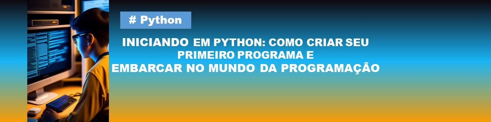
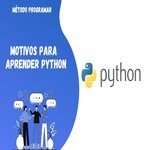
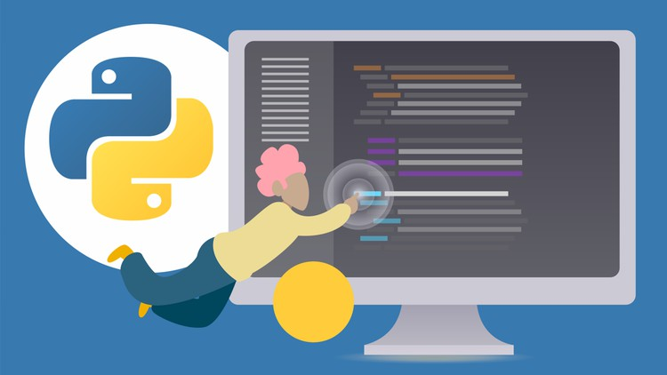

# Python - A Linguagem Mágica para Programadores

Oi, pessoal! Hoje vou falar sobre Python, uma linguagem de programação incrível que vai te deixar empolgado para criar coisas incríveis! Então, vamos começar!

 
Python é uma linguagem de programação muito popular e poderosa. Com ela, você pode criar programas, sites e até jogos! É como uma varinha mágica que permite que você dê vida às suas ideias. É fácil de aprender e usar, tornando-se uma ótima opção para quem está começando.

 
Python tem muitos benefícios! Primeiro, é uma linguagem muito legível, o que significa que é fácil entender o código de outras pessoas. Além disso, existem muitas bibliotecas prontas para usar, que ajudam a fazer coisas incríveis sem precisar começar do zero. E, acredite ou não, grandes empresas como Google, Instagram e YouTube usam Python em seus projetos!

 
A parte legal do Python é que a curva de aprendizado não é tão íngreme. Ou seja, você consegue começar a criar coisas legais rapidamente. Você pode aprender os conceitos básicos em pouco tempo e, aos poucos, ir se aprofundando. Lembre-se de praticar bastante e não ter medo de errar, porque é assim que aprendemos!

Conclusão 

Gostou de saber sobre Python?

#Python
## Fontes de Produção

Ilustrações de capa: gerada pela lexica.art.

Conteúdo gerado por: ChatGPT e revisões humanas.